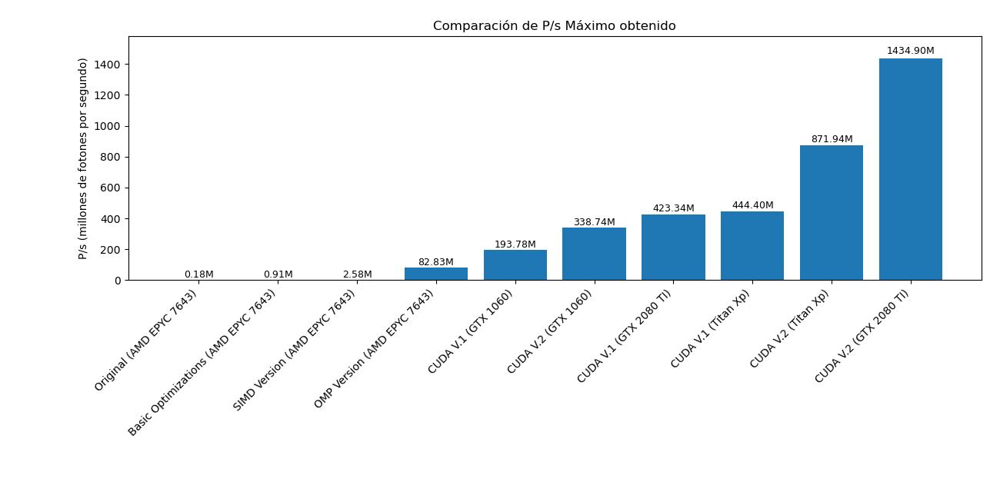

# Tiny Monte Carlo

This project contains a simple Monte Carlo simulation for photon transport. The main goal was to optimize the original implementation and measure the performance improvements achieved in different stages.

## References
- [Página en Wikipedia sobre el problema](https://en.wikipedia.org/wiki/Monte_Carlo_method_for_photon_transport)
- [Código original](https://omlc.org/software/mc/) de [Scott Prahl](https://omlc.org/~prahl/)

## Optimization phases
1. **Baseline tuning**: modified parts of the code and experimented with various compilation flags to obtain a starting point for comparison.
2. **Autovectorization**: applied compiler techniques to take advantage of vector instructions automatically.
3. **OpenMP parallelization**: added multi-threading support to run the simulation on multiple CPU cores.
4. **CUDA acceleration**: ported the most computationally intensive parts to run on the GPU.

## Results
The figure below summarizes the overall speedup after each phase:

